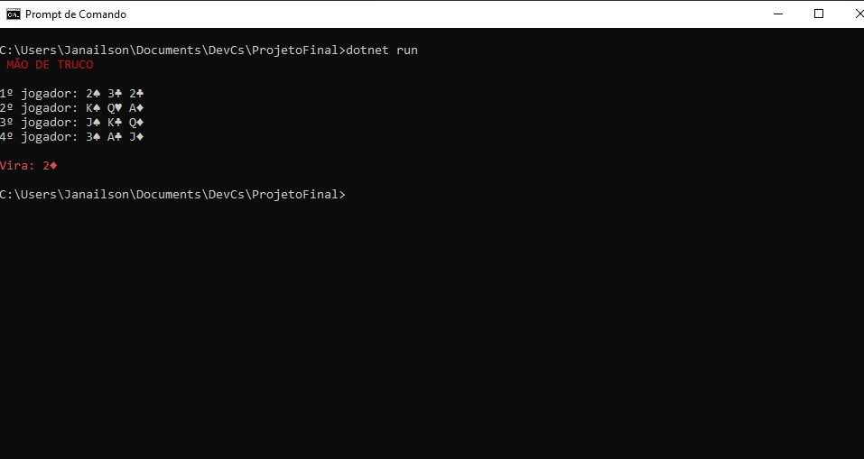

# ProjetoFinal

Este programa mostra as cartas de cada jogadores num jogo de truco, exibindo também a manilha inicial do baralho

## exemplo

```
MÂO DE TRUCO

1º jogador: Q♠ J♥ 3♠ 
2º jogador: 2♦ A♥ K♣ 
3º jogador: J♦ 3♥ 3♣ 
4º jogador: A♦ A♣ Q♥ 

Vira: Q♣
```
## _Screenshot_
Foto de tela do programa 



## Donwload 

Baixe o arquivo .zip pelo link abaixo:

[Donwload do arquivo .zip](dist/ProjetoFinal.zip.zip)

## Agradecimentos 

[Ermógenes Palacio](https://github.com/ermogenes)

[Diego Neri](https://github.com/diegoneri)

[Etec Adolpho Berezin](https://www.cps.sp.gov.br/etecs/etec-adolpho-berezin/)